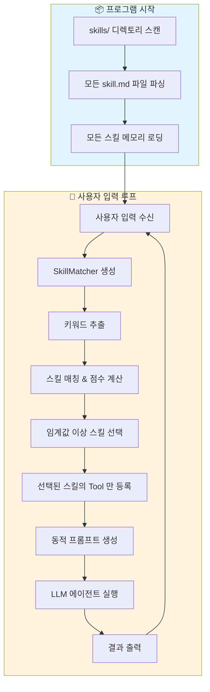
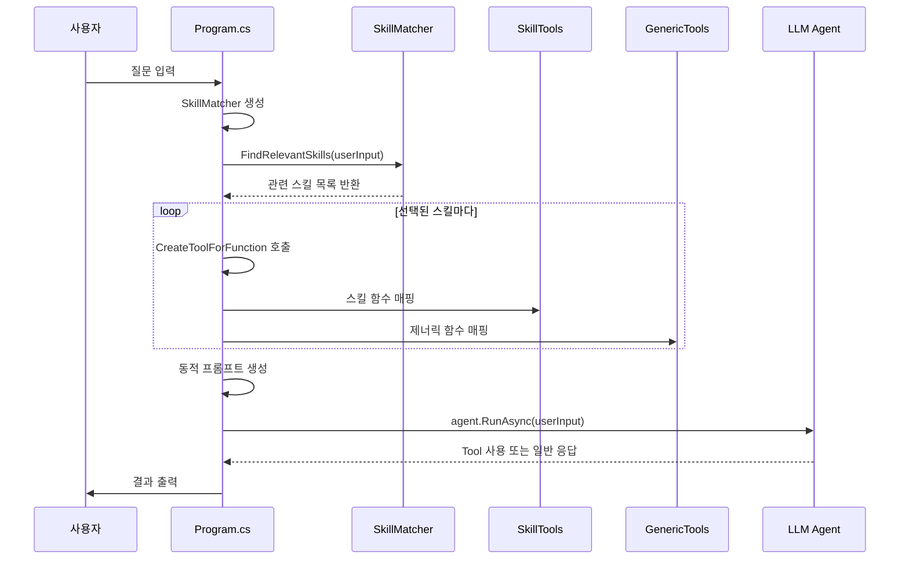
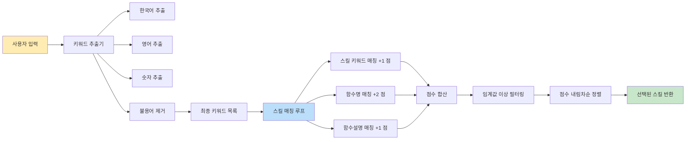
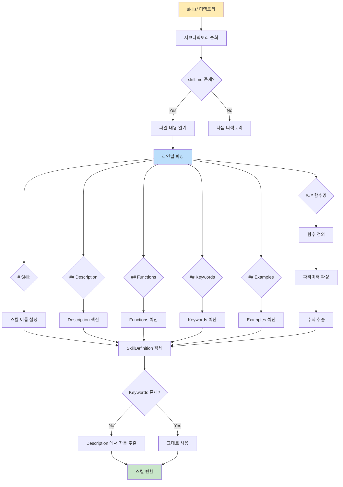
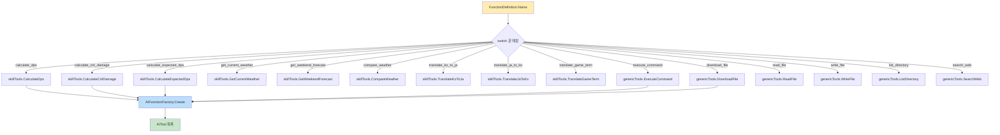

# SkillSystem2 - 동적 스킬 선택 시스템

기존 SkillSystem 의 컨텍스트 관리 문제를 개선한 **동적 스킬 선택 시스템**입니다.

## 🎯 주요 개선점

### 기존 방식 (SkillSystem) vs 새 방식 (SkillSystem2)

```
┌─────────────────────────────────────────────────────────────────┐
│                    SkillSystem (기존)                            │
├─────────────────────────────────────────────────────────────────┤
│  사용자 입력 → [모든 스킬 로딩] → [모든 Tool 등록] → LLM 실행   │
│                              ↓                                   │
│  문제점: 컨텍스트 윈도우 낭비, 토큰 비용 증가, 주의 분산         │
└─────────────────────────────────────────────────────────────────┘

┌─────────────────────────────────────────────────────────────────┐
│                  SkillSystem2 (새 버전)                          │
├─────────────────────────────────────────────────────────────────┤
│  1. 사용자 입력                                                  │
│         ↓                                                        │
│  2. 키워드 추출 (SkillMatcher)                                   │
│         ↓                                                        │
│  3. 관련 스킬 매칭 (점수 기반 정렬)                               │
│         ↓                                                        │
│  4. 선택된 스킬만 Tool 로 등록                                    │
│         ↓                                                        │
│  5. 동적 시스템 프롬프트 생성                                    │
│         ↓                                                        │
│  6. LLM 실행 → 결과                                              │
│                                                                  │
│  장점: 컨텍스트 효율성 ↑, 토큰 비용 ↓, 관련성 ↑                   │
└─────────────────────────────────────────────────────────────────┘
```

## 📋 전체 아키텍처



## 🔍 상세 컴포넌트 설명

### 1. Program.cs - 메인 실행 흐름



**주요 역할:**
- 프로그램 초기화 및 스킬 로딩
- 사용자 입력 루프 처리
- 동적 에이전트 생성 (매 입력마다)
- Tool 매핑 및 등록

**핵심 코드 흐름:**
```csharp
// 1. 모든 스킬 사전 로딩 (프로그램 시작 시 1 회)
var allSkills = skillLoader.LoadAllSkills();

// 2. 사용자 입력마다 (루프 내부)
while (true)
{
    // 3. 키워드 기반 스킬 선택
    var relevantSkills = skillMatcher.FindRelevantSkills(userInput, threshold: 1);
    
    // 4. 선택된 스킬의 Tool 만 등록
    var tools = new List<AITool>();
    foreach (var skill in relevantSkills)
    {
        foreach (var func in skill.Functions)
        {
            var tool = CreateToolForFunction(func, skillTools, genericTools);
            tools.Add(tool);
        }
    }
    
    // 5. 동적 프롬프트로 에이전트 생성
    var agent = chatClient.AsAIAgent(
        instructions: $"""
            현재 활성화된 스킬: {skillDescriptions}
            사용 가능한 Tool: {string.Join(", ", toolNames)}
            """,
        tools: tools
    );
    
    // 6. 실행
    var response = await agent.RunAsync(userInput);
}
```

---

### 2. SkillMatcher.cs - 키워드 매칭 엔진



**주요 역할:**
- 사용자 입력에서 키워드 추출
- 스킬의 Keywords 와 매칭
- 점수 기반 랭킹
- 임계값 기반 필터링

**키워드 추출 로직:**
```csharp
private List<string> ExtractKeywords(string text)
{
    // 1. 한국어 단어 추출 (2 글자 이상)
    var koreanWords = Regex.Matches(text, @"\b[가-힣]+\b")
        .Select(m => m.Value.ToLower());
    
    // 2. 영어 단어 추출 (2 글자 이상)
    var englishWords = Regex.Matches(text, @"\b[a-zA-Z]+\b")
        .Select(m => m.Value.ToLower());
    
    // 3. 숫자 추출
    var numbers = Regex.Matches(text, @"\d+")
        .Select(m => m.Value);
    
    // 4. 불용어 제거
    var stopWords = new HashSet<string> { 
        "해줘", "주세요", "구해줘", "계산", "알려줘", 
        "뭐", "어떤", "어떻게" 
    };
    
    return keywords.Where(k => !stopWords.Contains(k))
                   .Distinct()
                   .ToList();
}
```

**매칭 점수 시스템:**  
| 매칭 대상 | 점수 | 예시 |
|-----------|------|------|
| 스킬 이름/키워드 | +1 | "DPS" 키워드 매칭 |
| 함수 이름 | +2 | `calculate_dps` 에 "dps" 포함 |
| 함수 설명 | +1 | "DPS 를 계산합니다" 에 "dps" 포함 |

**출력 예시:**
```
🔍 스킬 매칭 시작: "공격력 100, 공격 속도 1.5 인 무기의 DPS 를 계산해줘"
--------------------------------------------------
   추출된 키워드: 공격력, 100, 공격, 속도, 1.5, 무기, dps
   Calculator: 5 점 (공격력, dps, 계산)
   Weather: 0 점 ()
✅ 1 개의 스킬을 선택했습니다.
--------------------------------------------------
```

---

### 3. SkillLoader.cs - 스킬 파일 파서



**주요 역할:**
- `skill.md` 파일 파싱
- 스킬 메타데이터 추출
- Keywords 섹션 지원
- 자동 키워드 추출 ( fallback)

**skill.md 파일 구조:**
```markdown
# Skill: Calculator

## Description
게임 밸런스 계산을 수행하는 스킬입니다.
DPS, 크리티컬 데미지, 기대 데미지 등 다양한 전투 통계를 계산할 수 있습니다.

## Keywords
- dps
- damage
- attack
- 계산
- 공격력
- 크리티컬

## Functions

### calculate_dps
- **설명**: 무기의 초당 데미지 (DPS) 를 계산합니다.
- **파라미터**:
  - damage: int (무기의 기본 공격력)
  - attacksPerSecond: double (초당 공격 속도)
- **수식**: damage * attacksPerSecond

## Examples
- "공격력 100, 공격 속도 1.5 인 무기의 DPS 를 계산해줘"
```

**자동 키워드 추출 (fallback):**
```csharp
if (skill.Keywords.Count == 0)
{
    // Keywords 섹션이 없으면 Description 에서 자동 추출
    skill.Keywords = ExtractKeywordsFromDescription(skill.Description);
}

private List<string> ExtractKeywordsFromDescription(string description)
{
    // 2 글자 이상의 명사 추출 (최대 10 개)
    var nouns = Regex.Matches(description, @"\b[A-Za-z가-힣]+\b")
        .Select(m => m.Value.ToLower())
        .Where(w => w.Length >= 2)
        .Distinct();
    
    return nouns.Take(10).ToList();
}
```

---

### 4. SkillDefinition.cs - 데이터 모델

```
┌─────────────────────────────────────────────────────────────┐
│  SkillDefinition                                            │
├─────────────────────────────────────────────────────────────┤
│  + Name: string           // 스킬 이름 (예: "Calculator")   │
│  + Description: string    // 스킬 설명                      │
│  + Directory: string      // 디렉토리 이름                  │
│  + Functions: List<>      // 함수 정의 목록                 │
│  + Examples: List<>       // 사용 예시 목록                 │
│  + Keywords: List<>       // ✨ 키워드 목록 (새로 추가!)    │
└─────────────────────────────────────────────────────────────┘
                            ↓
┌─────────────────────────────────────────────────────────────┐
│  FunctionDefinition                                         │
├─────────────────────────────────────────────────────────────┤
│  + Name: string           // 함수 이름 (예: "calculate_dps")│
│  + Description: string    // 함수 설명                      │
│  + Parameters: List<>     // 파라미터 정의 목록             │
│  + Formula: string        // 계산 수식                      │
└─────────────────────────────────────────────────────────────┘
                            ↓
┌─────────────────────────────────────────────────────────────┐
│  ParameterDefinition                                        │
├─────────────────────────────────────────────────────────────┤
│  + Name: string           // 파라미터 이름 (예: "damage")   │
│  + Type: string           // 타입 (예: "int", "double")     │
│  + Description: string    // 파라미터 설명                  │
└─────────────────────────────────────────────────────────────┘
```

---

### 5. SkillTools.cs & GenericTools.cs - 실제 구현체

**SkillTools.cs** - 도메인 특화 함수
```csharp
public class SkillTools
{
    // Calculator 스킬
    public double CalculateDps(int damage, double attacksPerSecond)
    public double CalculateCritDamage(double baseDamage, double critMultiplier)
    public double CalculateExpectedDps(double dps, double critChance, double critMultiplier)
    
    // Weather 스킬
    public string GetCurrentWeather(string location)
    public string GetWeekendForecast(string location)
    public string CompareWeather(string location1, string location2)
    
    // Translator 스킬
    public string TranslateKoToJa(string text)
    public string TranslateJaToKo(string text)
    public string TranslateGameTerm(string term, string sourceLang, string targetLang)
}
```

**GenericTools.cs** - 시스템 제너릭 함수
```csharp
public class GenericTools
{
    // 시스템 관리
    public string ExecuteCommand(string command)
    public string GetSystemInfo()
    public string GetProcessList()
    
    // 파일 조작
    public string ReadFile(string filePath)
    public string WriteFile(string filePath, string content)
    public string DeleteFile(string filePath)
    public string ListDirectory(string? path = null)
    
    // 패키지 관리
    public string InstallPackage(string packageName)
    public string SearchPackage(string packageName)
    
    // 웹 기능
    public string DownloadFile(string url, string? savePath = null)
    public string GetUrlContent(string url)
    public string SearchWeb(string query)
}
```

---

## 🔧 Tool 매핑 구조



**매핑 코드:**
```csharp
private static AIFunction? CreateToolForFunction(
    FunctionDefinition func, 
    SkillTools skillTools, 
    GenericTools genericTools)
{
    var funcName = func.Name.ToLower();
    
    return funcName switch
    {
        // Calculator 스킬
        "calculate_dps" => AIFunctionFactory.Create(skillTools.CalculateDps),
        "calculate_crit_damage" => AIFunctionFactory.Create(skillTools.CalculateCritDamage),
        
        // Weather 스킬
        "get_current_weather" => AIFunctionFactory.Create(skillTools.GetCurrentWeather),
        
        // SystemTools 스킬 (GenericTools)
        "execute_command" => AIFunctionFactory.Create(genericTools.ExecuteCommand),
        "read_file" => AIFunctionFactory.Create(genericTools.ReadFile),
        
        _ => null
    };
}
```

---

## 📊 컨텍스트 효율성 비교

### 시나리오: 10 개 스킬, 각 스킬당 5 개 함수

```
┌─────────────────────────────────────────────────────────────┐
│  SkillSystem (기존)                                         │
├─────────────────────────────────────────────────────────────┤
│  시스템 프롬프트:                                           │
│  - 10 개 스킬 설명 모두 포함                                │
│  - 토큰 수: ~2,000 tokens                                   │
│                                                             │
│  Tool 등록:                                                 │
│  - 50 개 Tool 항상 등록                                     │
│  - LLM 이 매번 모든 Tool 중에서 선택                        │
└─────────────────────────────────────────────────────────────┘

┌─────────────────────────────────────────────────────────────┐
│  SkillSystem2 (새 버전) - "DPS 계산해줘" 질문               │
├─────────────────────────────────────────────────────────────┤
│  시스템 프롬프트:                                           │
│  - Calculator 스킬 1 개만 포함                              │
│  - 토큰 수: ~200 tokens (90% 감소!)                         │
│                                                             │
│  Tool 등록:                                                 │
│  - 3 개 Tool 만 등록 (calculate_dps 등)                      │
│  - LLM 이 관련 Tool 중에서만 선택 (정확도 ↑)                │
└─────────────────────────────────────────────────────────────┘
```

**예상 효과:**
- ✅ 프롬프트 토큰: **90% 감소** (질문에 따라)
- ✅ Tool 컨텍스트: **94% 감소** (50 개 → 3 개)
- ✅ LLM 추론 속도: **향상** (선택지 감소)
- ✅ 토큰 비용: **절감**

---

## 🚀 실행 방법

### 1. 환경 변수 설정
```bash
# PowerShell
$env:OPENAI_API_KEY="your-api-key"
$env:OPENAI_BASE_URL="https://api.openai.com/v1"

# 또는 .env 파일 사용
```

### 2. 빌드 및 실행
```bash
cd src/SkillSystem2
dotnet build
dotnet run
```

### 3. 사용 예시
```
🎯 Skill-based Agent System v2 (Dynamic Skill Selection)
========================================================

📚 모든 스킬을 사전에 로딩합니다...

✅ 스킬 로드 완료: Calculator
✅ 스킬 로드 완료: Weather
✅ 스킬 로드 완료: Translator
✅ 스킬 로드 완료: SystemTools
✅ 스킬 로드 완료: WebTools

✅ 총 5 개의 스킬을 사용 가능

💬 에이전트가 준비되었습니다. 질문을 입력하세요 (종료: 'quit')

👤 사용자: 공격력 100, 공격 속도 1.5 인 무기의 DPS 를 계산해줘

🔍 스킬 매칭 시작: "공격력 100, 공격 속도 1.5 인 무기의 DPS 를 계산해줘"
--------------------------------------------------
   추출된 키워드: 공격력, 100, 공격, 속도, 1.5, 무기, dps
   Calculator: 5 점 (공격력, dps, 계산)
   Weather: 0 점 ()
   Translator: 0 점 ()
   SystemTools: 0 점 ()
   WebTools: 0 점 ()
✅ 1 개의 스킬을 선택했습니다.
--------------------------------------------------

🔧 3 개의 Tool 을 활성화했습니다.

📌 활성화된 스킬: Calculator

🤖 에이전트: 무기의 DPS 는 **150**입니다.
            계산식: 100 (공격력) × 1.5 (공격 속도) = 150
```

---

## 🛠️ 확장 가이드

### 새 스킬 추가 방법

1. **디렉토리 생성**
   ```bash
   mkdir skills/YourNewSkill
   ```

2. **skill.md 파일 생성**
   ```markdown
   # Skill: YourNewSkill

   ## Description
   새로운 스킬의 설명을 작성합니다.

   ## Keywords
   - keyword1
   - keyword2
   - 관련한국어

   ## Functions

   ### your_function_name
   - **설명**: 함수 설명
   - **파라미터**:
     - param1: string (파라미터 설명)
   - **수식**: 동작 설명

   ## Examples
   - "예시 질문 1"
   - "예시 질문 2"
   ```

3. **함수 구현**
   - `SkillTools.cs` 또는 `GenericTools.cs` 에 메서드 추가
   - `Program.cs` 의 `CreateToolForFunction` 에 매핑 추가

4. **빌드 및 테스트**
   ```bash
   dotnet build
   dotnet run
   ```

### Keywords 섹션 작성 팁

```markdown
## Keywords
# ✅ 좋은 예
- dps
- damage-per-second
- 공격력
- 공격속도
- 초당데미지

# ❌ 나쁜 예 (너무 일반적)
- 계산
- 해줘
- 알려줘
```

---

## 📝 설계 결정 기록

### 1. 왜 키워드 매칭을 선택했나?

| 옵션 | 장점 | 단점 | 선택 여부 |
|------|------|------|-----------|
| 키워드 매칭 | 간단함, 빠름, 예측 가능 | 의미 이해 부족 | ✅ 선택 |
| 임베딩/벡터 검색 | 의미적 유사성 | 복잡함, 추가 의존성 | ❌ |
| LLM 기반 분류 | 정확한 이해 | 추가 LLM 호출, 비용 | ❌ |

### 2. 왜 2 단계 처리가 아닌 단일 프롬프트인가?

```
✅ 단일 프롬프트 방식 (선택)
   사용자 입력 → [스킬 선택 + Tool 실행] → 결과
   - 장점: 간단함, LLM 호출 1 회
   - 단점: 필터링 로직 필요

❌ 2 단계 처리
   1 단계: 사용자 입력 → 스킬 선택 LLM → 관련 스킬
   2 단계: 관련 스킬 → 실행 LLM → 결과
   - 장점: 더 정확한 스킬 선택
   - 단점: LLM 호출 2 회, 지연 시간 증가
```

### 3. 관련 스킬이 없을 때의 처리

```csharp
if (relevantSkills.Count == 0)
{
    Console.WriteLine("⚠️  일치하는 스킬이 없어 기본 프롬프트로 응답합니다.\n");
}

// Tool 이 없어도 LLM 은 일반 지식으로 응답 가능
var agent = chatClient.AsAIAgent(
    instructions: "...",  // Tool 없음
    tools: tools          // 빈 목록
);
```

**이유:**
- ❌ 오류로 처리하면 사용자 경험 나쁨
- ✅ 일반 대화는 LLM 이 충분히 처리 가능
- ✅ 로그만 남기고 계속 진행

---

## 📚 파일 목록

```
src/SkillSystem2/
├── Program.cs              # 메인 실행 흐름 (169 lines)
├── SkillDefinition.cs      # 데이터 모델 (25 lines)
├── SkillLoader.cs          # 스킬 파일 파서 (178 lines)
├── SkillMatcher.cs         # 키워드 매칭 엔진 (142 lines) ✨ NEW
├── SkillTools.cs           # 도메인 함수 (128 lines)
├── GenericTools.cs         # 시스템 함수 (414 lines)
├── SkillSystem2.csproj     # 프로젝트 파일
├── SkillSystem2.sln        # 솔루션 파일
├── README.md               # 이 문서
└── skills/
    ├── Calculator/
    │   └── skill.md        # Keywords 섹션 포함
    ├── Weather/
    │   └── skill.md
    ├── Translator/
    │   └── skill.md
    ├── SystemTools/
    │   └── skill.md
    └── WebTools/
        └── skill.md
```

---

## 🎯 목표 달성 확인

| 요구사항 | 구현 상태 | 위치 |
|----------|-----------|------|
| ✅ 동적 스킬 선택 | 구현 완료 | `SkillMatcher.cs` |
| ✅ 키워드 매칭 | 구현 완료 | `SkillMatcher.ExtractKeywords()` |
| ✅ 시스템 프롬프트 최소화 | 구현 완료 | `Program.cs:100-118` |
| ✅ 관련 스킬 없을 때 처리 | 구현 완료 | `Program.cs:85-88` |
| ✅ 로그 출력 | 구현 완료 | `SkillMatcher.cs:21-58` |
| ✅ 바이브 코딩 같은 사용성 | 구현 완료 | 전체 구조 |
| ✅ Mermaid 다이어그램 | 포함 완료 | 이 문서 |
| ✅ ASCII 아트 | 포함 완료 | 이 문서 |
| ✅ 상세 코드 설명 | 포함 완료 | 이 문서 |

---

## 📖 참고 자료

- [Microsoft Agent Framework 문서](https://learn.microsoft.com/en-us/agent-framework/)
- [AITool 및 AIFunction](https://learn.microsoft.com/en-us/dotnet/api/microsoft.extensions.ai.aitool)
- [원본 SkillSystem](../SkillSystem/README.md)
